# Container Promotion Template Overview
The promotion template provided by SAS uses a GitOps process to move the container across environments automatically, which saves the IT team time and resources. In this process, SAS Viya acts as the development environment. You will use a few resources on Azure, including Azure Container Registry, where a copy of the container is stored, and Azure Kubernetes Service, which acts as the testing and production environments. You will also use open-source orchestration tools, including GitHub, Flux CD, and Jenkins. GitHub will store a copy of the container files, including a deployment descriptor. This deployment descriptor provides instructions for the GitOps controller, including instructions on where to find the container within Azure Container Registry, how to communicate with the container, what namespace it should be deploying to within Azure Kubernetes Service, and how many processing nodes should be within the cluster. An open-source tool called Flux CD is used to act as the GitOps controller because it provides integration between the deployment descriptor in the GitHub repository and the Kubernetes cluster. And finally, Jenkins, a popular open-source automation tool is used. 

The process starts after a model or decision has been developed on SAS Viya. Models and decisions can be published directly into Azure Container Registry just as the deployment descriptor is pushed into the GitHub repository. For model publishing, the CI/CD promotion assets include a SAS Workflow Manager definition. This workflow definition containerizes the champion model within a project, deploys the container into Azure Container Registry, pushes the deployment descriptor into the GitHub repository, and then starts the Jenkins pipeline. For users publishing decisions or non-champion models, the models and decisions can be published from SAS Viya and the Jenkins pipeline can be started manually using the published name as a parameter. 

The Jenkins pipeline passes the deployment description to Flux CD, where it makes the appropriate changes within the testing Kubernetes Cluster on Azure Kubernetes Service. After the testing cluster has been configured and the container is running, Jenkins runs data through the container to validate that it is scoring as expected. Upon successfully validating the container in the testing environment, Flux CD repeats the process on the production environment. After the container is running, it is ready to score data. 

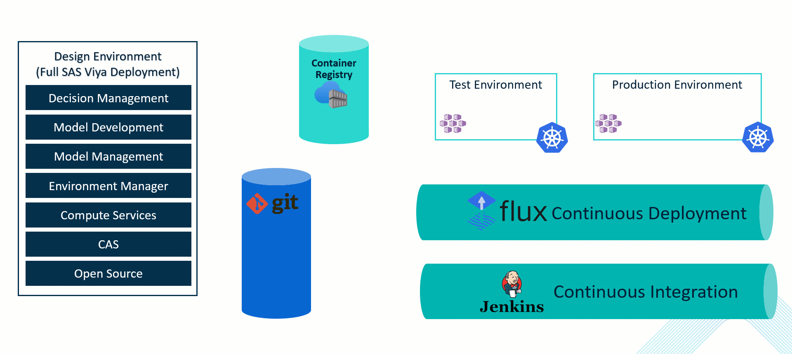

Organizations can pass data to the container using the REST API. REST API is a standard for communication between applications, so this makes it easy to leverage container scoring within an application or process. 
 
 ## Configuring the Promotion Template 
To start using the promotion pipeline template, you must first add a few configurations to each environment that the pipeline touches. After you have completed the configurations, the pipeline automates promotion and validation, which saves time and reduces future headaches.


<b>Note:</b> For the Azure configuration steps, please check with your Azure administrator for help with determining the correct region for your Azure environment.


<b>Note:</b> Configuring the various Azure components can be performed in the Azure Portal, Azure CLI, Azure PowerShell, or an Azure Resource Management (ARM) template. This guide uses the Azure Portal, but any method can be used.

### Azure Resource Group
1. Log in to the [Azure Portal](https://portal.azure.com).
2. Search for "Resource groups".
3. Create a new resource group. Recommended name: "deploymentOrchestration". An existing resource group can also be used. 

<b>Note:</b> This resource group should be used in subsequent Azure configuration steps unless otherwise specified.

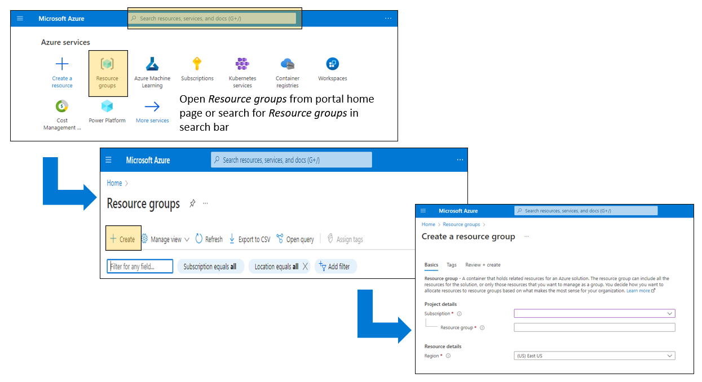

Alternatively, you can use the Azure CLI to create a resource group: 
```bash
az group create --name deploymentOrchestration --location eastus
```

For more information, see [Manage Azure Resources](https://learn.microsoft.com/en-us/azure/azure-resource-manager/management/).

### Azure Container Registry
1. Log in to the [Azure Portal](https://portal.azure.com).
2. Search for "Container registries".
3. Create a new registry. Recommended name: "OrchestrationRegistry". An existing registry can also be used.

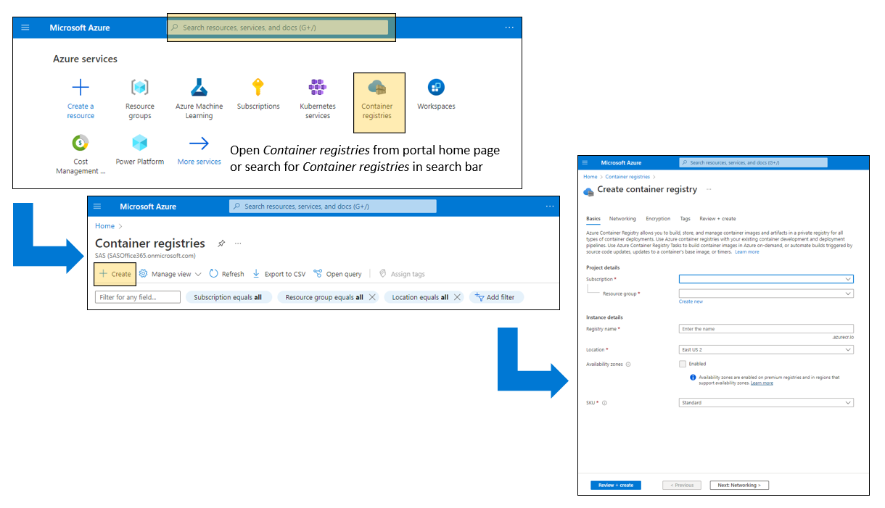

Alternatively, you can use the Azure CLI to create a container registry: 
```bash
az acr create --resource-group deploymentOrchestration --name OrchestrationRegistry --sku Basic --location eastus --admin-enabled true

```

4. Register an application and a secret with Azure Secure App. Allow the app to push and pull images from the Azure Container Registry. Assign the app access to the Azure Kubernetes Service validation cluster and add role assignments for Azure Kubernetes Cluster Admin and Azure Kubernetes Service Contribution Role.
5. Save your Azure Tenant ID, Subscription ID, Container Registry Login Server (Base Repository URL), Application (Client) ID, Application Secret, Resource Group where the validation AKS cluster is deployed, and the name of the AKS validation cluster.

For more information, see [Azure Container Registry](https://learn.microsoft.com/en-us/azure/container-registry/) and [Bogdan Teleuca’s article, How to Publish a SAS Model to Azure with SCR: A Start-to-Finish Guide](https://communities.sas.com/t5/SAS-Communities-Library/How-to-Publish-a-SAS-Model-to-Azure-with-SCR-A-Start-to-Finish/ta-p/768714).

### Azure Kubernetes Service
1. Log in to the [Azure Portal](https://portal.azure.com).
2. Search for "Kubernetes services".
3. Create a new Kubernetes service named "testing".
   1. Select a Kubernetes version of 1.23 or later.
   2. Select the Integrations tab and set the Container registry to the registry configured above.
4. Create a new Kubernetes service named "production".
   1. Select a Kubernetes version of 1.23 or later.
   2. Select the Integrations tab and set the Container registry to the registry configured above.
5. Assign Azure Kubernetes Service Cluster Admin Role for both clusters to your user.
6. Next, [export a single kubeconfig file](https://docs.microsoft.com/en-us/azure/aks/control-kubeconfig-access) with keys for both clusters. Ensure that the kubeconfig is linked to the Kubernetes cluster with pull authorization. 

<b>Note:</b> There are a lot of configuration options associated with the Kubernetes services. The default settings are recommended as a starting point, but for better integration in you overall system, you will need to consult the configuration guide or you Azure administrator.

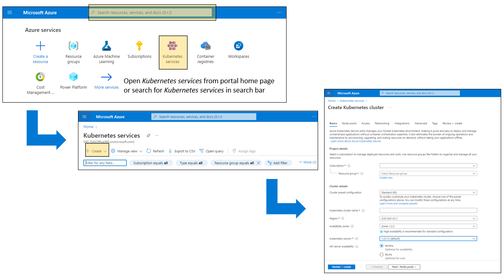

For more information, see the [Azure Kubernetes Service (AKS)](https://learn.microsoft.com/en-us/azure/aks/) documentation.

Alternatively, you can use the Azure CLI to create the two AKS clusters, assign the service admin role, and export the single config file:
 ```bash

# Create a test cluster.
az aks create -g deploymentOrchestration -n testing --enable-managed-identity --node-count 1 --enable-addons monitoring --enable-msi-auth-for-monitoring  --generate-ssh-keys

# Create a prod cluster.
az aks create -g deploymentOrchestration -n production --enable-managed-identity --node-count 1 --enable-addons monitoring --enable-msi-auth-for-monitoring  --generate-ssh-keys

# Get the account credentials for the logged in user.
ACCOUNT_UPN=$(az account show --query user.name -o tsv)
ACCOUNT_ID=$(az ad user show --id $ACCOUNT_UPN --query id -o tsv)

# Assign the 'Cluster Admin' role to the user for test cluster. 
AKS_CLUSTER=$(az aks show --resource-group deploymentOrchestration --name testing --query id -o tsv)
az role assignment create \
    --assignee $ACCOUNT_ID \
    --scope $AKS_CLUSTER \
    --role "Azure Kubernetes Service Cluster Admin Role"

# Assign the 'Cluster Admin' role to the user for production cluster. 
AKS_CLUSTER=$(az aks show --resource-group deploymentOrchestration --name production --query id -o tsv)
az role assignment create \
    --assignee $ACCOUNT_ID \
    --scope $AKS_CLUSTER \
    --role "Azure Kubernetes Service Cluster Admin Role"

# Export the config file.
az aks get-credentials --resource-group deploymentOrchestration --name testing --admin
az aks get-credentials --resource-group deploymentOrchestration --name production --admin

cat ~/.kube/config

sudo az aks install-cli

kubectl config view

kubectl config get-contexts
kubectl config current-context

kubectl config use-context production-admin
kubectl config use-context testing-admin
```


### Azure Virtual Machine
1. Log in to the [Azure Portal](https://portal.azure.com).
2. Search for "Virtual machines".
3. Create a new Virtual Machine. Recommended name "orchestrationVM".
   1. Use a Linux base image. Recommend "Ubuntu Server 20.04 LTS" or later.
   2. Select x64 Architecture.
   3. Select a small VM size (B1s or B2s is adequate). If this will be shared with other processes, then a larger size might be necessary.
   4. Generate or use an existing SSH key pair. 

<b>Note:</b>This VM is used later for Jenkins and FluxCD installations.

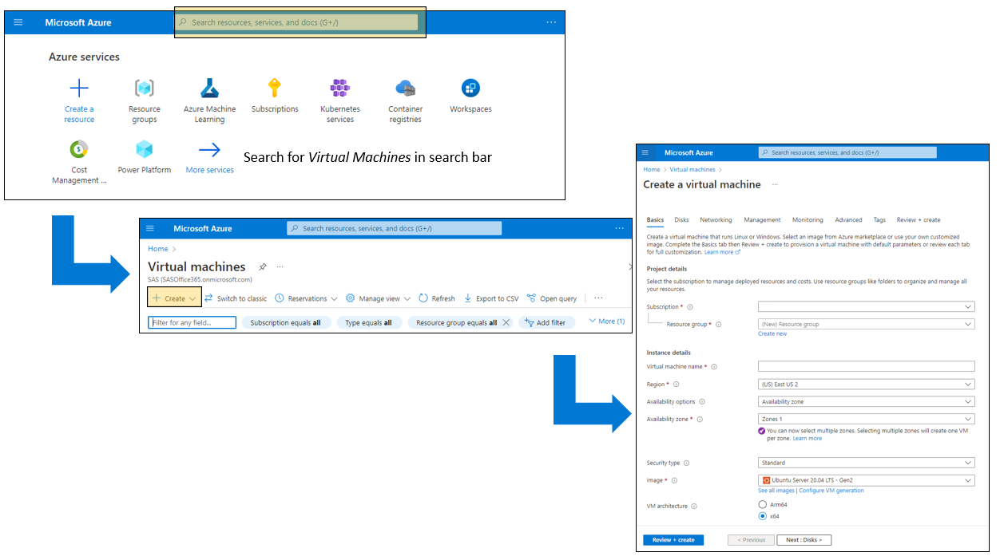

For more information, see [Virtual machines in Azure](https://learn.microsoft.com/en-us/azure/virtual-machines/).

### GitHub Repositories
1. Log in to [GitHub](https://github.com/).
2. Create a new private repository named "orchestration".
3. Download the [orchestration_template.zip](./resources/orchestration_template.zip) file.
4. Copy the folder structure and all files from orchestration_template.zip into the "orchestration" repository.

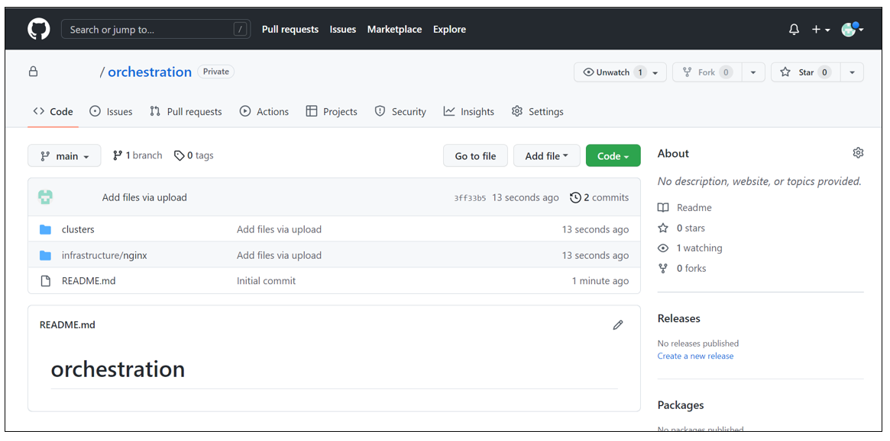

5. Create a new private repository named "published_models".
6. Download the [published_models_template.zip](./resources/published_models_template.zip) file.
7. Copy the folder structure and all files from published_models_template.zip into the "published_models" repository.

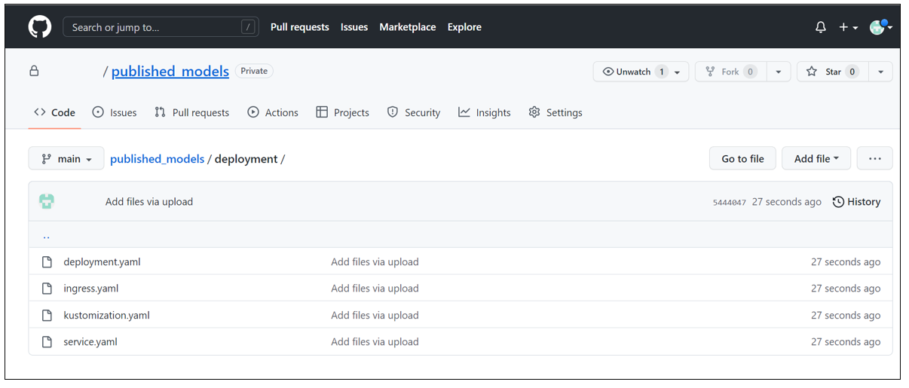

8. Generate a new Personal Access Token.
   1. In the upper right corner of any page, click your profile photo, and then click <b>Settings</b>.
   2. In the left sidebar, click <b>Developer settings</b>. 
   3. In the left sidebar, click <b>Personal access tokens</b>. 
   4. Click <b>Generate new token</b>.
   5. Give your token a descriptive name. Recommended name: "orchestrationToken".

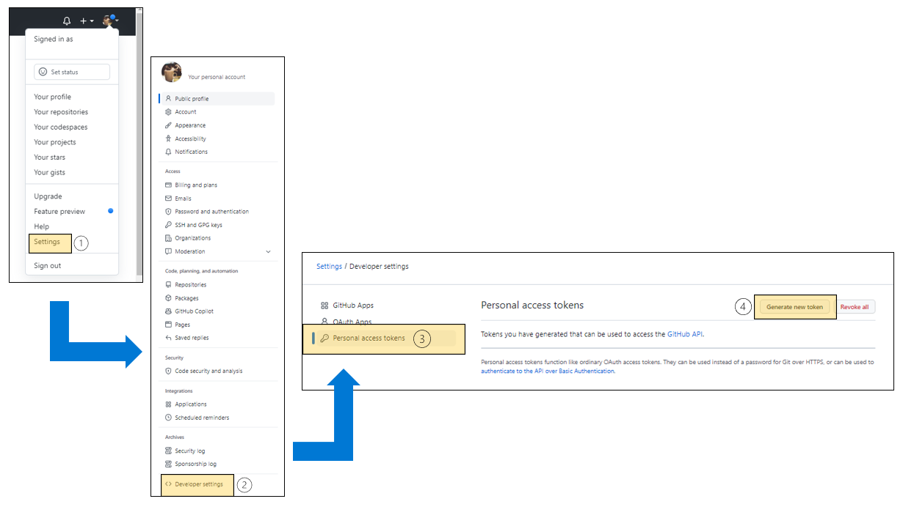

9. Keep the token for later configurations in Jenkins.

For more information, see [GitHub documentation](https://docs.github.com/en).

### Jenkins 
1. Log in to the shell of the Azure virtual machine that you previously configured.
2. Execute the following shell commands:
```bash
sudo apt update
sudo apt install python3
sudo apt install python3-pip
python3 -m pip install jproperties
python3 -m pip install pygit
python3 -m pip install pygithub
sudo apt install default-jre
sudo apt install jenkins
```
<b>Note:</b> Depending on your networking configuration, it might be necessary to create an Azure firewall rule to access the port 8080 on the virtual machine.


3. Complete your installation of Jenkins by following the steps listed in the [Post-Installation Setup Wizard](https://www.jenkins.io/doc/book/installing/linux/#setup-wizard).
4. From Jenkins, select + New Item. Enter gitOps_sync as the item’s name, select Pipeline as the item’s type, and then select OK. On the configuration view, make the following changes:
   1. Select <b>This Project is Parameterized</b>.
   2. Add a new <b>Credentials Parameter</b> and specify values for the following fields:
      - Name: GITOPS_GIT_CREDENTIAL
      - Credential type: Username with password
      - Default Value: Access key for GitHub
      - Description: Credential for logging in to the remote Git repository
   3.	Add a new <b>String Parameter</b> and specify values for the following fields:
         -  Name: GIT_REPOSITORY
         -  Default Value: orchestration
         -  Description: Repository in the Git account to target
   4.	Add a new String Parameter and specify values for the following fields:
         - Name: PROMOTION_CLUSTER
         - Default Value: testing
         - Description: Cluster for GitOps to deploy to
   5.	Under the Pipeline configuration settings, select <b>Pipeline script</b> from SCM for the definition.
   6.	Select <b>Git</b> as the SCM.
   7.	Enter the repository URL for your published_models GitHub repository.
   8.	Select <b>Access key for GitHub</b> for the type of credentials.
   9. Enter */main for the branch specifier.
   10. Enter ci/git_deployment/Jenkinsfile for the script path. 
   11. Click <b>Save</b>.

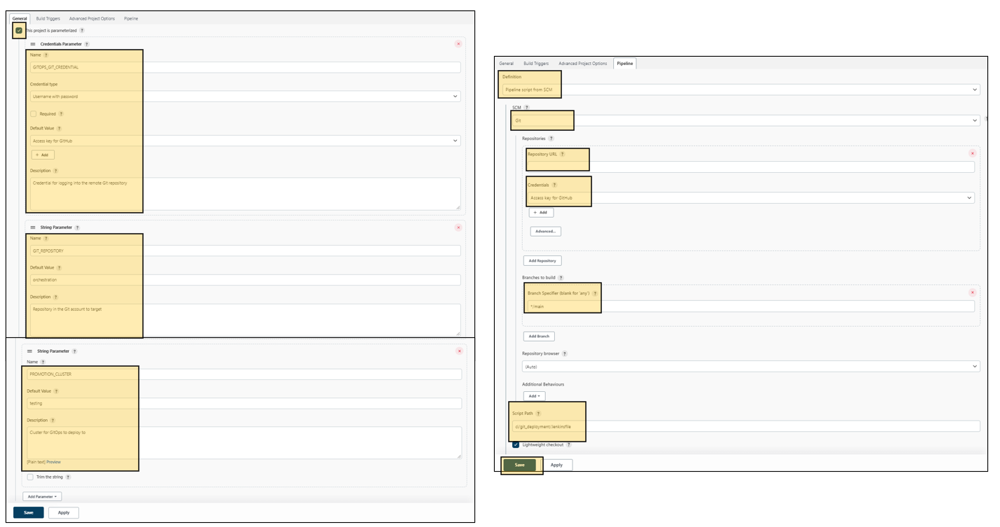

### Flux CD
1. Install Azure CLI.
```bash
sudo apt install azure-cli

# Login
az login
```
2. Install kubectl.
```bash
curl -LO "https://dl.k8s.io/release/$(curl -L -s https://dl.k8s.io/release/stable.txt)/bin/linux/amd64/kubectl"
sudo install -o root -g root -m 0755 kubectl /usr/local/bin/kubectl
```
For more information, see [Install and Set Up kubectl on Linux](https://kubernetes.io/docs/tasks/tools/install-kubectl-linux/).

3. Export a single kubeconfig file with keys for both clusters.
```bash
# Testing
az aks get-credentials --resource-group deploymentOrchestration --name testing --admin

# Production
az aks get-credentials --resource-group deploymentOrchestration --name production --admin

# Display list of contexts -- you will see the current context with an asterisk *
kubectl config get-contexts
```
<b>Note:</b> Ensure that the kubeconfig is linked to the Kubernetes cluster with pull authorization.

4. Install Flux CLI.
```bash
curl -s https://fluxcd.io/install.sh | sudo bash
```

5. Bootstrap testing and production clusters for the Flux CD.
```bash
export GITHUB_TOKEN="<Token from GitHub configuration>"
export GITHUB_USER="<User name for the GitHub account>"
export GITHUB_REPO="orchestration"

flux bootstrap github --context=testing-admin --owner=${GITHUB_USER} --repository=${GITHUB_REPO} --branch=main --personal --path=clusters/testing

flux bootstrap github --context=production-admin --owner=${GITHUB_USER} --repository=${GITHUB_REPO} --branch=main --personal --path=clusters/production
```

### SAS Viya Environment Manager and SAS Studio
1. From [SAS Environment Manager, import](https://go.documentation.sas.com/doc/en/sasadmincdc/v_027/calpromotion/n0djzpossyj6rrn1vvi1wfvp2qhp.htm) the [RunTestingPushPipeline job file](./resources/RunTestingPushPipeline.json) and the [RunProductionPushPipeline job file](./resources/RunProductionPushPipeline.json). 
2. Open both job files in SAS Studio. Add your Jenkins username, key, and URL into both the jobs, where specified. 

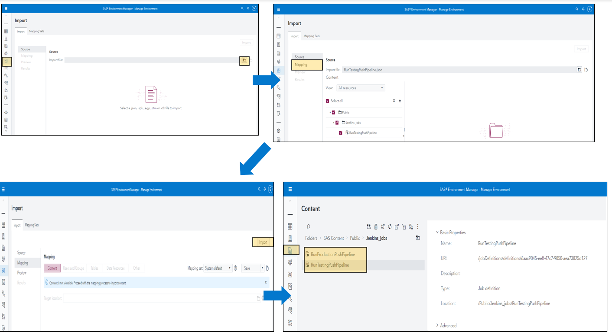


### SAS Viya Command Line Interface
If using SAS Viya 2022.1.2 or later, you can use the CLI to define the publishing destination. 
1. The SAS Viya command-line interface (CLI) enables you to interact directly with the SAS Viya REST services. You enter commands on a command line and receive responses from the system. You can use the CLI to work with SAS Viya programmatically, as an alternative to using a graphical user interface (GUI). If this is the first time your organization has used the Command Line Interface (CLI) , [you must download the CLI and configure SAS Viya to run the CLI](https://go.documentation.sas.com/doc/en/sasadmincdc/v_031/calcli/n1e2dehluji7jon1gk69yggc6i28.htm). 
2. Sign in to SAS Viya via the CLI using the following code:
```bash
sas-viya auth login
```

3. Configure a publishing destination for Azure with Git using the CLI by filling out the fields below with the information that you have saved from the previous steps. If you are running the CLI from a Window’s machine, replace the \ at the end of each line with a ^. This character tells the interface that the command continues on the next line, which enables you to make the command more human-readable. 

```bash
sas-viya models destination createAzure \ 
--name name-for-the-publishing-destination \
--baseRepoURL base-repo-url-from-azure-container-registry \
--tenantId azure-tenant-id \
--subscriptionId azure-subscription-id \
--resourceGroupName resource-group-for-aks-validation-cluster \
--kubernetesCluster name-of-aks-validation-cluster  \
--region regional-location-of-resources \
--credDomainID name-for-credential-domain \
--clientID client-id-for-azure \
--clientSecret client-secret-for-azure \
--gitUserUd github-user-id \
--gitAccessToken github-access-token \
--remoteRepoURL url-for-model-publish-github-repo \
--localRepoLocation _ocation-of-local-Viya-git-repo \
--userEmail email-used-with-github-repo 

```

### SAS Model Manager
1.	Create a model and register the model into SAS Model Manager. Mark this model as champion. 

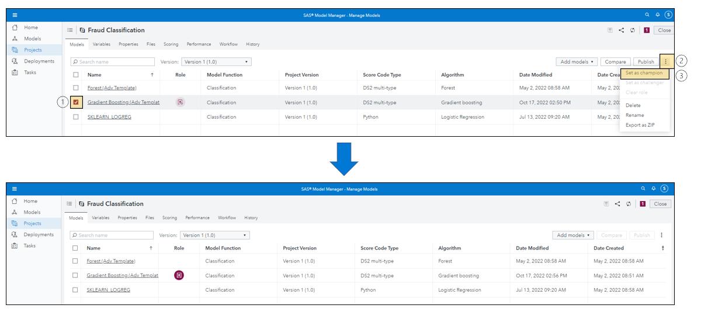

<b>Note:</b> To deploy a decision, create a decision in SAS Intelligent Decisioning instead. 

### SAS Workflow Manager
<b>Note:</b> To deploy a decision, you can skip the configuration steps for SAS Workflow Manager. You will need to manually deploy the decision instead.

1.	If this is the first time your organization has used SAS Workflow Manager, you will need to [configure the default workflow administrator group](https://go.documentation.sas.com/doc/en/wfscdc/v_016/wfsag/n1hgjqwqj65u94n182f8zxah2m8w.htm) and add your user to that group as well as [configure the default service account](https://go.documentation.sas.com/doc/en/wfscdc/v_016/wfsag/p1j1q517695r6cn17osi5y1xa6vq.htm).

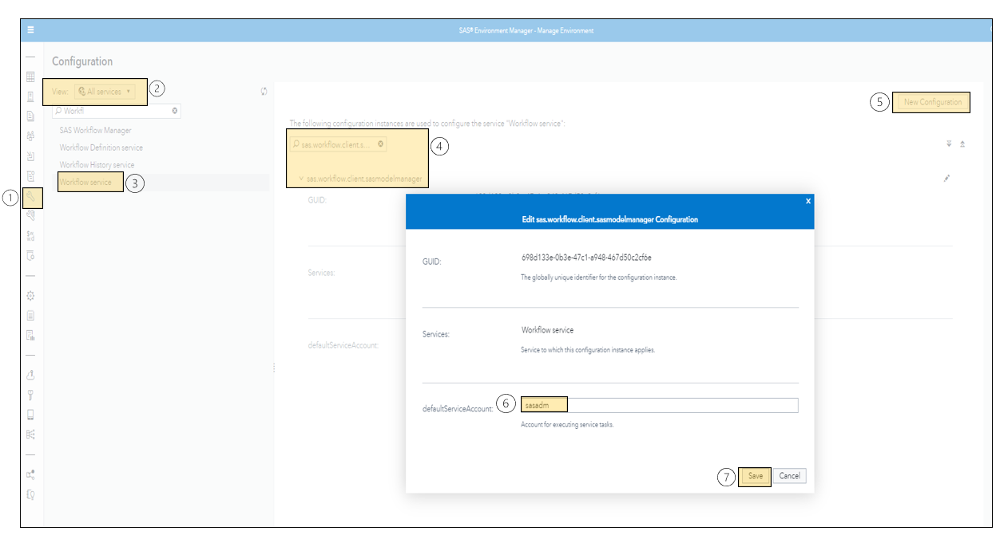

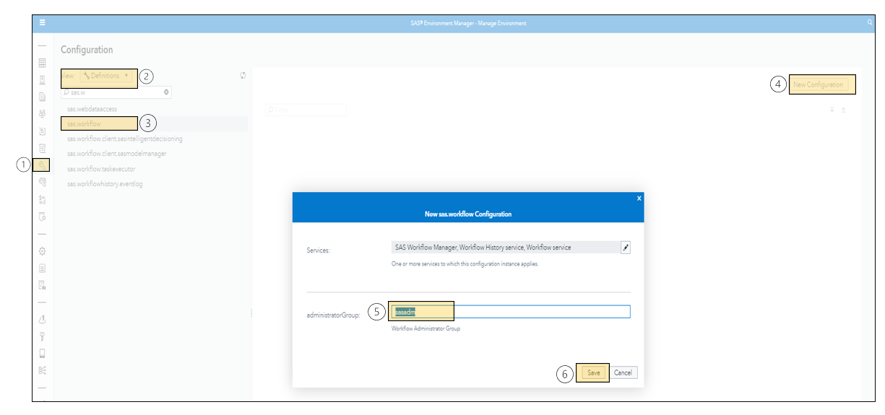

2.	Once SAS Workflow Manager has been configured and your user has the appropriate permissions, [you will need to download the provided Workflow definition](./resources/GitOps.bpmn), [import the definition into SAS Workflow Manager](https://go.documentation.sas.com/doc/en/wfscdc/v_016/wfsug/n02kjtks2mgn8pn11vmvrd3noban.htm). 
3.	Review the workflow template and adjust as needed, such as changing the wait time on the timer or adding additional manual approvals.
4.	Finally, [activate the workflow definition](https://go.documentation.sas.com/doc/en/wfscdc/v_016/wfsug/n0edxyuotldxg9n1bcrzw5hj4fyq.htm). 

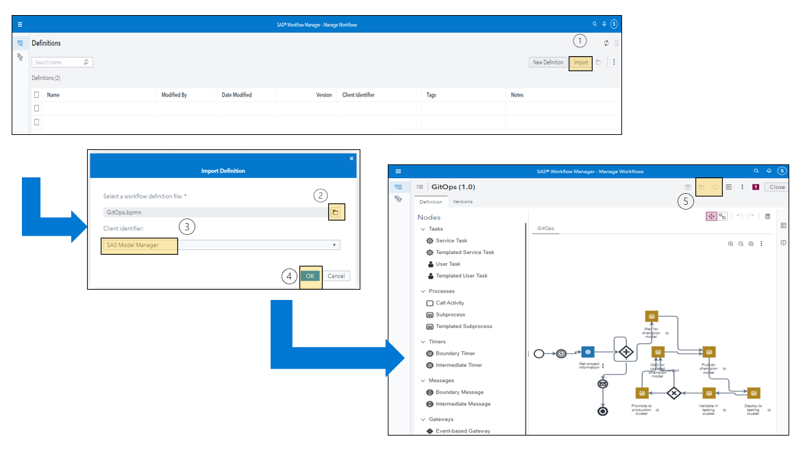


## Additional Configuration and Customization
At this point, the full system is almost ready to be used. However, there are a few additional configurations that are required as well as some customizations to be aware of.

### Customization Properties in the Deployment Templates
In the deployment templates, a placeholder pattern is used for common fields that are used during the deployment process. There are two standard patterns that are seen in the deployment descriptor templates:
- ${sas-scr-published-name} -- this field is replaced with the published named of the model. In this example, it is _fraudchamp_. When using the workflow, the published name is captured when starting the workflow as the deployment name for the project. This field is used in numerous places in the deployment templates. 
   - The deployment of the SCR container uses this name (for example, _fraudchamp_).
   - The pod associated with the deployment is <name>-<random-id> (for example, _fraudchamp-6bd4456fb7-89wdn_).
   - The service associated with the deployment is <name>-service (for example, _fraudchamp-service_).
   - The ingress associated with the deployment is <name>-ingress (for example, _fraudchamp-ingress_).
- ${sas-scr-image-url} -- this field is replaced with the url to the container registry entry for the published model. This used when Kubernetes pulls the SCR container image for deployment.

Nothing needs to be done with these properties for this example. However, these fields can be used if you want to make changes to the provided deployment templates.

There are also additional placeholders that are used during the deployment process. The Jenkins continuous-integration scripts replace these placeholders and they are specific to the cluster to which you are deploying. The two placeholders described below are used in this example and are specified in the provided deployment descriptor templates. But additional properties can be added to support additional customizations specific to your deployment requirements.

- ${custom-scr-namespace} -- this field defines the namespace where the artifacts associated with the deployment will execute (for example, _orchestration_).
- ${custom-scr-host} -- this field defines the host url used by the NGINX ingress. This is the http url that is used when accessing then endpoints of the SCR container (for example, _testingcluster.mycompany.com_).

These placeholders are defined in the "published_models" cluster in the "ci/custom/<cluster_name>/custom_properties.custom_properties" file. These properties must be defined prior to using this template.

For more information about the ingress host setup, see [Kubernetes ingress concepts](https://kubernetes.io/docs/concepts/services-networking/ingress/).

## Using the Template
Now you are ready to use the template to deploy your champion model from SAS Model Manager and start the GitOps workflow. To deploy your decision, publish your decision into the Azure Container Registry and manually start the Jenkins pipeline. Watch as the container moves from your Azure Test Environment to your Azure Production Environment. After the container is running in production, you are ready for scoring. 

<b>Note:</b> The deployment name must consist only of lowercase and alphanumeric characters, and cannot start with a numeric character. 

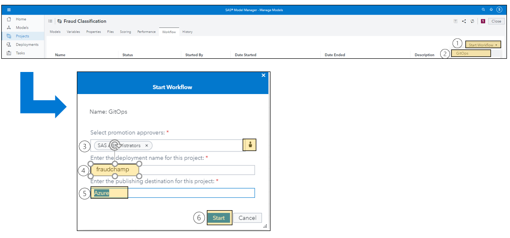

To score the container, perform these steps:
1.	Find the scoring endpoint for the deployed model or decision within the container. There are a few ways to accomplish this, such as using the Kubernetes configuration file exported from Azure Kubernetes Service. 
2.	Prepare data in JSON format.
3.	Pass data to the endpoint and wait for the response. 

[This notebook](./resources/Scoring_Data_with_Container_Example.ipynb) includes example code for passing transactional and batch data to the endpoint. 

