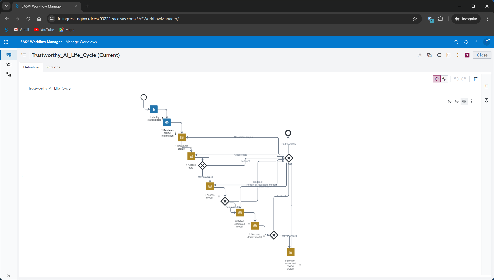

# SAS&#174; Trustworthy AI Life Cycle

The Trustworthy AI Life Cycle workflow definition outlines steps to evaluate and deploy a trustworthy AI system via model assessment, fairness 
and explainability evaluation, performance monitoring, and the appropriate data use. The workflow is informed by 
[SAS&#174; Model Manager](http://documentation.sas.com/?cdcId=mdlmgrcdc&cdcVersion=default) capabilities and 
the [_NIST AI Risk Management Framework_](https://www.nist.gov/itl/ai-risk-management-framework) as it appeared in October 2023.

_**Note:** Version 2.0.0 of the Trustworthy AI Life Cycle workflow is also delivered with SAS Model Manager as of the 2024.09 stable release. 
Version 1.1.0-beta and previous versions of the workflow are experimental. 
Your thoughts, questions, and comments are welcome to enhance future versions of this workflow. 
Leave feedback using the **Issues** tab of the [Model Management Resources](https://github.com/sassoftware/model-management-resources) GitHub repository._ 

## Target Audience

The Trustworthy AI Life Cycle workflow is designed for teams who collaborate to create, test, and implement models. Though titles can differ, the workflow requires input from the following roles:

* model owner who is the decision-maker
* data scientist who develops the model
* engineer familiar with deployment
* risk owner who identifies, manages and documents risks associated with the model
* data engineer who selects and prepares data for the model
* domain expert who can address business and domain-specific questions. 

Note: Any other roles tied to modeling supported within an organization could provide a valuable contribution as well.

## Prerequisite Knowledge

Although the Trustworthy AI Life Cycle workflow provides examples and techniques as a guide, users of the workflow should be generally familiar with these model management steps: data processing, model creation, testing, documentation, risk management, deployment, and monitoring.

## Installation

Follow these steps to install the Trustworthy AI Life Cycle workflow:

1. Download and extract the contents of the Trustworthy_AI_Life_Cycle ZIP file.
2. Import the Trustworthy_AI_Life_Cycle.bpmn file into SAS Workflow Manager, and select **SAS Model Manager** as the client identifier. 
   This creates a workflow definition named **Trustworthy_AI_Life_Cycle** by default.
3. Select the **Trustworthy_AI_Life_Cycle** definition.
4. [Customize timer settings](#customizing-timer-settings). 

   _**Note:** Any changes made to the timer settings after the workflow has been activated will create a new workflow version that must be activated._

5. Create a new version of the definition. 
   
   _**Note:** A new workflow version must be created before the workflow can be activated. Make sure the version is not set to "Current"._

6. Activate the new version of the definition. 

   _**Note:** Only administrators can activate the workflow definition._

For more information, see [Import and Activate a Workflow Definition](https://documentation.sas.com/?cdcId=mdlmgrcdc&cdcVersion=default&docsetId=mdlmgrqs&docsetTarget=p19zkxhqe0bvten1f1j1j7h6f7e4.htm#n1dk8lz6tczsunn17mluyiyvabsx) 
in _SAS Model Manager: Quick Start Tutorial_ and 
[_SAS Workflow Manager_: User's Guide](https://documentation.sas.com/?cdcId=wfscdc&cdcVersion=default).

## Usage

Run the Trustworthy_AI_Life_Cycle workflow against a SAS Model Manager project.

### Configuring the Workflow Client

An administrator must configure a user account in order for the workflow automation to execute. For more information, see [Configure SAS Workflow](https://documentation.sas.com/?cdcId=mdlmgrcdc&cdcVersion=default&docsetId=mdlmgrag&docsetTarget=n059pfaemov51yn1grxyy7ot991u.htm) in *SAS Model Manager: Administrator's Guide*.

### Creating a SAS Model Manager Project

If you do not already have a SAS Model Manager project, you can follow the [Quick Start Tutorial](https://documentation.sas.com/?cdcId=mdlmgrcdc&cdcVersion=default&docsetId=mdlmgrqs&docsetTarget=titlepage.htm) to create one.

### Identifying Stakeholders

The individual who starts the workflow must be an administrator. That person, when starting the workflow, identifies a model owner via the initial prompt. The model owner must be available through the SAS&#174; Viya&#174; platform Identities service and have the appropriate permissions. The model owner must be an administrator in order to use SAS Workflow Manager to monitor the progress of workflow instances.

The workflow assigns the model owner a user task to identify the remaining participants, such as the model developer and data engineer. Those participants must 
also be available through the SAS Viya platform Identities service and should have the appropriate permissions.

The model owner can identify multiple users for a given role. For any user task, the first assigned user to claim the task is allowed to complete or release it.

### Monitoring Performance

The workflow expects that one or more KPI alert rules have been defined for the SAS Model Manager project. To learn how to define KPI alert rules, see [Add KPI Rules](https://documentation.sas.com/?cdcId=mdlmgrcdc&cdcVersion=default&docsetId=mdlmgrug&docsetTarget=n1l40mg261mm9en1ehs4qiiro51p.htm#n1tikm4ftq9nuon1w0glpqe3fjp1) in *SAS Model Manager: User's Guide*.

The workflow will perform periodic automated performance monitoring of the champion model for the SAS Model Manager project. If monitoring triggers one or more KPI alert rules, then the workflow issues a user task to the model owner to review the performance definition and KPI alert rules. The workflow also sends a KPI alert message to a [Microsoft Teams channel](https://learn.microsoft.com/en-us/microsoftteams/teams-channels-overview), if one has been identified. The administrator identifies the channel when starting the workflow.

#### Identifying the Microsoft Teams Channel

To set up the workflow to send KPI alert messages to a Microsoft Teams channel, first you must configure a [Microsoft Power Automate flow template](https://learn.microsoft.com/en-us/power-automate/get-started-logic-template). You should configure the built-in template **Post to a channel when a webhook request is received**. 

Next, in Microsoft Teams, select the desired channel, and then select **Workflows** from the ellipsis. In the Workflows window, select the template **Post to a channel when a webhook request is received**. Follow the instructions. Teams will generate a webhook URL for you. Copy and save it. This is the URL that the administrator specifies when starting the Life Cycle workflow.

Note that the Life Cycle workflow and Teams workflow are separate technologies.

### Customizing Timer Settings

The workflow defines user-customizable timer settings. After you have imported the **Trustworthy_AI_Life_Cycle** definition, select the definition and navigate to the following subprocesses to customize the timer settings:

1. The time delay between model performance monitoring cycles; the default is set to one month.

	a. Navigate to the first step of subprocess 8.1 to access this timer node.

2. How long to wait for a model performance definition to execute; the default is set to thirty seconds.

	a. Navigate to the step after node 8.1.1.3 to access this timer node.

3. How long to wait for model performance results; the default is set to two minutes.

	a. Navigate to the step after node 8.1.2 to access this timer node.

4. The time delay between project review cycles; the default is set to six months.

	a. Navigate to the first step of subprocess 8.2 to access this timer node.

Review the settings and, if necessary, adjust them according to your business needs and execution environment.

For more information, see [Using Timers](https://documentation.sas.com/?cdcId=wfscdc&cdcVersion=default&docsetId=wfsug&docsetTarget=p0rkmi3glzmjgzn1tq567i4e6k41.htm) in _SAS Workflow Manager: User's Guide_.

### Producing Documentation

Use the _Trustworthy AI Life Cycle Workflow Documentation Template_ (Trustworthy_AI_Life_Cycle_Companion.docx) 
in conjunction with the SAS Trustworthy AI Life Cycle workflow. 

_Note: This file is included in the Trustworthy_AI_Life_Cycle ZIP file._

## See Also

[Enforce Responsible AI Best Practices: Trustworthy AI Life Cycle Workflow Available](https://communities.sas.com/t5/SAS-Communities-Library/Enforce-Responsible-AI-Best-Practices-Trustworthy-AI-Life-Cycle/ta-p/912717)

## Contributing

Contributions from users other than the SAS Model Manager support team can be added to the 
[external-samples](../external-samples) subdirectory.

## License

[Apache 2.0 License](../../../LICENSE)
